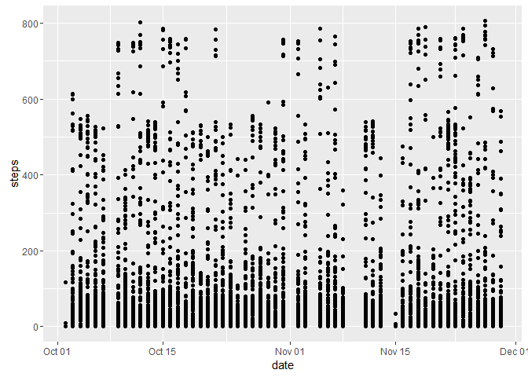

# Reproducible Research: Peer Assessment 1

#### Set Working directory


```r
#setwd("G:/RWrokingDirectory")
```

#### Check for the folder "data" exists in the working directory.


```r
if (!file.exists("data")){
    dir.create("data")
}
```

#### Getting the data from internet and unzip it.


```r
download.file("https://d396qusza40orc.cloudfront.net/repdata%2Fdata%2Factivity.zip", "data/repdata data activity")
filename <- unzip("data/repdata data activity")
```

## Loading and preprocessing the data


```r
checkActivity <- read.csv(filename, stringsAsFactors = FALSE)
str(checkActivity)
```

```
## 'data.frame':	17568 obs. of  3 variables:
##  $ steps   : int  NA NA NA NA NA NA NA NA NA NA ...
##  $ date    : chr  "2012-10-01" "2012-10-01" "2012-10-01" "2012-10-01" ...
##  $ interval: int  0 5 10 15 20 25 30 35 40 45 ...
```

Here from above data, below observations are found -  
1.The date column do not contain values in date format.   
2.There are multiple values found as "N/A" for column steps

Hence we will convert the format to date for column date.


```r
checkActivity$date <- as.Date(checkActivity$date)
str(checkActivity)
```

```
## 'data.frame':	17568 obs. of  3 variables:
##  $ steps   : int  NA NA NA NA NA NA NA NA NA NA ...
##  $ date    : Date, format: "2012-10-01" "2012-10-01" ...
##  $ interval: int  0 5 10 15 20 25 30 35 40 45 ...
```

And count for null values in column steps


```r
sum(is.na(checkActivity$steps))
```

```
## [1] 2304
```


As we found N/A marked rows are 2304, we will skip that data for next two questions analysis.


```r
activityremoveNA <- checkActivity[which(!is.na(checkActivity$steps)), ]
head(activityremoveNA)
```

```
##     steps       date interval
## 289     0 2012-10-02        0
## 290     0 2012-10-02        5
## 291     0 2012-10-02       10
## 292     0 2012-10-02       15
## 293     0 2012-10-02       20
## 294     0 2012-10-02       25
```

Please find below graph for above data.


```r
library(ggplot2)
qplot(date, steps, data = activityremoveNA)
```



## What is mean total number of steps taken per day?

To calculate total number of steps taken per day, we need to take sum of all steps date wise.


```r
stepsPerDay <- tapply(activityremoveNA$steps, activityremoveNA$date, sum)
head(stepsPerDay)
```

```
## 2012-10-02 2012-10-03 2012-10-04 2012-10-05 2012-10-06 2012-10-07 
##        126      11352      12116      13294      15420      11015
```

Here it is found that there is only data present for month of October'2012 and November'2012

Now we have received data for per day, so we will calculate mean for total number of steps taken per day.


```r
mean(stepsPerDay)
```

```
## [1] 10766.19
```

## What is the average daily activity pattern?

To get daily average activity pattern, we have to aggregate dataset by particular intervals.  Here we consider 5 minute interval. The X-axis contains interval value. 

Consider below values like 500 = 5:00, 1000 = 10:00 and so on. Hence complete 24 hours from midnight to next day midnight ending hour.


```r
dailyavg <- tapply(activityremoveNA$steps, activityremoveNA$interval, mean)
head(dailyavg)
```

```
##         0         5        10        15        20        25 
## 1.7169811 0.3396226 0.1320755 0.1509434 0.0754717 2.0943396
```

```r
plot(y = dailyavg, x = names(dailyavg), type = "l", xlab = "5 Minute Interval", 
    main = "Daily Activity Pattern", ylab =  "Average Number of Steps")
```


```r
dailyavg[dailyavg == max(dailyavg)]
```

```
##      835 
## 206.1698
```

Here It is found that the daily average value is 835 for steps 206.1698.

## Imputing missing values

As we have seen above there are 2304 values missing which are coded as "N/A".  Now check other two columns missing data if any.


```r
sum(is.na(checkActivity))
```

```
## [1] 2304
```

Both counts are matching which is taken for missing steps and overall missing values in the dataset.

Calculate total percentage of missing values as compared to total observations.


```r
(sum(is.na(checkActivity))/nrow(checkActivity))*100
```

```
## [1] 13.11475
```

Hence only 13.11 % data is missing.

As there is a 5 minute interval, below command will generate data along with filled missing data with mean valu
es.


```r
newData <- checkActivity
newData[which(is.na(newData$steps)),1] <- dailyavg[as.character(newData[which(is.na(newData$steps)),3])]
```

Now check for missing values present in the dataset.


```r
sum(is.na(newData))
```

```
## [1] 0
```

Here found there are no missing values in the dataset.

Below graphs displays the difference between missing values and the values replaced with mean values. 


```r
valueperday <-tapply(newData$steps, newData$date, sum)
```


```r
par(mfrow=c(1,2))
hist(stepsPerDay,10, main = "Total no. of steps per day", xlab = "Steps", ylab = "Intervals", ylim =c(0, 25))
abline(v = median(stepsPerDay), col = 4, lwd = 4)
hist(valueperday,10, main = "Total no. of steps per day  
     (missing values replaced with 
     mean of interval)", xlab = "Steps", ylab = "Intervals",
     ylim =c(0, 25))
abline(v = median(valueperday), col = 4, lwd = 4)
```


The impact of inputting missing data is minimal, as only the median seems to be changing but by just over one step.


```r
mean(valueperday)-mean(stepsPerDay)
```

```
## [1] 0
```


```r
median(valueperday)-median(stepsPerDay)
```

```
## [1] 1.188679
```


## Are there differences in activity patterns between weekdays and weekends?

Check date column is in date format.


```r
str(newData)
```

```
## 'data.frame':	17568 obs. of  3 variables:
##  $ steps   : num  1.717 0.3396 0.1321 0.1509 0.0755 ...
##  $ date    : Date, format: "2012-10-01" "2012-10-01" ...
##  $ interval: int  0 5 10 15 20 25 30 35 40 45 ...
```

For calculating weekdays and weekends data, we need to factor the data accordingly.


```r
newData$wd <- weekdays(newData$date)

newData[newData$wd == "Sunday" | newData$wd == "Saturday", 5 ] <- "weekend"
newData[!(newData$wd == "Sunday" | newData$wd == "Saturday"), 5] <- "weekday"

#newData
```


To get the difference between weekdays and weekends, the aggregation of steps per 5 minutes interval need to be derived.


```r
new_weekend <- subset(newData, newData$V5 == "weekend")
#new_weekend

new_weekday <- subset(newData, newData$V5 == "weekday")
#new_weekday
```

Take aggregate value for weekend and week day data.


```r
dailyactivity_weekend <- tapply(new_weekend$steps, new_weekend$interval, mean)
dailyactivity_weekday <- tapply(new_weekday$steps, new_weekday$interval, mean)

#dailyactivity_weekend
#dailyactivity_weekdday
```

Create plot to display the activities.


```r
par(mfrow = c(2, 1))

plot(names(dailyactivity_weekday), 
     dailyactivity_weekday, 
     type = "l",
     xlab = "5-Minute Interval", 
     ylab = "Average number of steps",
     main = "Daily Activity pattern on Weekdays",
     ylim =c(0, 250)
     ) 

plot(names(dailyactivity_weekend), 
     dailyactivity_weekend, 
     type = "l",
     xlab = "5-Minute Interval", 
     ylab = "Average number of steps",
     main = "Daily Activity pattern on Weekends",
     ylim =c(0, 250)
     ) 
```


From above two graphs, it is clear that the distribution throughout the day is quite different.  
First of all, the individual from whom the measurements were taken, seems to wake up at least one hour later at the weekends.  
Another interesting finding is that there is a huge amount of steps taken on weekdays, possibly while going to work or working out, which does not appear on Saturdays or Sundays.  
Generally, the whole weekend seems to be more evenly distributed with no huge deviations during hours when a normal person is expected to be awake and active.  
But, we can observe on average more steps during a weekend day, than on a "working" day. So, this individual is currently employed (or a volunteer), he/she does not take the car to and from work. 

Please, once more, keep in mind that the x-axis point labels are the names of the intervals in the dataset. The coding of the interval names is such, so that e.g. 500 should be conidered as 5:00 and 1000 as 10:00, ans so on. So, one can consider th x-axis as a full 24-hour-day starting from midnight and ending at the next midnight hour.


